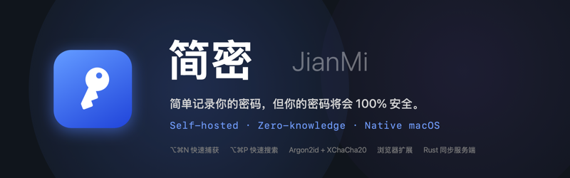
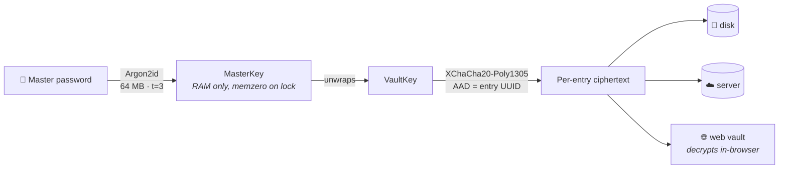
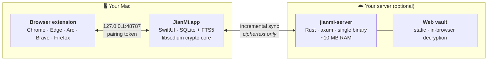

<div align="center">



<br>

[](https://github.com/LordVibeCoding/jianmi/releases/latest)
[](https://github.com/LordVibeCoding/jianmi/releases/latest)
[](apps/macos)
[](server)
[](apps/macos/JianMiTests)
[](LICENSE)

**English** · [简体中文](README_zh.md)

*Your passwords never leave your hands — not ours, not anyone's.*

[**Install**](#-install) · [**How it feels**](#-how-it-feels) · [**Security**](#-security) · [**Self-hosting**](#%EF%B8%8F-self-hosting) · [**FAQ**](#-faq)

</div>

---

## Why JianMi?

Every password manager asks you to trust *someone*. JianMi asks you to trust **math and your own hardware** — nothing else.

|                          | **JianMi**            | 1Password       | Bitwarden          | KeePassXC       |
| ------------------------ | --------------------- | --------------- | ------------------ | --------------- |
| Your vault lives on      | 🏠 **your Mac / your server** | their cloud | their cloud¹       | a local file    |
| macOS client             | ⚡️ **native Swift**   | Electron        | Electron           | Qt              |
| Idle memory footprint    | **~30 MB**            | ~300 MB         | ~250 MB            | ~90 MB          |
| Per-entry "never sync"   | ✅ **enforced in code** | ❌             | ❌                 | n/a (no sync)   |
| Capture-a-login hotkey   | ✅ **&lt; 5 seconds**  | partial         | ❌                 | ❌              |
| Entry-level sync merge   | ✅                    | ✅              | ✅                 | ❌ (whole-file) |
| Price                    | **free · MIT**        | subscription    | freemium           | free            |

<sub>¹ Bitwarden can be self-hosted via Vaultwarden, but the desktop client remains Electron.</sub>

## ✨ How it feels

**Signing up somewhere?** Press <kbd>⌥⌘N</kbd> anywhere.
A Spotlight-style panel appears with the site name and URL **already filled in** (reported live by the browser extension — zero macOS permissions, zero prompts). Type a username, roll a strong password with 🎲, hit <kbd>↩</kbd>. Saved. Under 5 seconds.

**Logging in?** Press <kbd>⌥⌘P</kbd>, type three letters:

| Key | Action |
|---|---|
| <kbd>↩</kbd> | copy password *(clipboard self-destructs in 30 s)* |
| <kbd>⌥↩</kbd> | copy username |
| <kbd>⌘↩</kbd> | open the site & copy password |
| <kbd>⌃↩</kbd> | auto-type straight into the focused field |

**In the browser?** Click the extension icon — matching logins for the current site appear with **Fill**, **Copy password** and **2FA** buttons. Works with React/Vue forms.

**Everything else** lives in a clean three-pane main window: colored type badges, Markdown notes with live rendering, TOTP with a countdown ring, custom fields, password history, pinnable always-on-top mini windows, and a menu-bar item that shows lock state at a glance.

## 📦 Install

### 1 · The app

Download **`JianMi-x.y.z.dmg`** from [Releases](https://github.com/LordVibeCoding/jianmi/releases/latest) → drag **JianMi** into **Applications**.

> **First launch:** right-click → *Open* (builds are ad-hoc signed — no Apple Developer account, by design).
> Or: `xattr -cr /Applications/JianMi.app`

<details>
<summary>Prefer to build from source? (recommended for maximum trust)</summary>

```bash
brew install xcodegen
git clone https://github.com/LordVibeCoding/jianmi && cd jianmi/apps/macos
xcodegen generate
xcodebuild -scheme JianMi -configuration Release build
```
</details>

### 2 · The browser extension

Open the app → **Settings → Browser Extension** → **Export extension pack**, then:

| Browser | Steps |
|---|---|
| Chrome / Edge / Arc / Brave | unzip → `chrome://extensions` → *Developer mode* → *Load unpacked* |
| Firefox | `about:debugging` → *This Firefox* → *Load Temporary Add-on* |

Paste the **pairing token** (same settings page) into the extension. That's it — the extension only ever talks to `127.0.0.1`.

### 3 · Sync server *(optional — the app is fully functional offline)*

See [Self-hosting](#%EF%B8%8F-self-hosting) below.

## 🔐 Security

**The chain of custody, end to end:**



- **Zero-knowledge everywhere.** The sync server stores `uuid + version + ciphertext` — nothing else. So does your disk: run `strings` on the SQLite file, you'll find no secrets (we have a [test](apps/macos/JianMiTests/VaultTests.swift) that does exactly that).
- **`local_only` is physical, not cosmetic.** Wallet-seed-type entries are force-flagged and filtered out *before* the sync engine's network layer — the code path to the server does not exist for them.
- **No recovery backdoor.** Forgot the master password? Your one-time recovery code is the only way back in. We consider this a feature.
- **Cross-language proof.** Swift-encrypted fixtures are decrypted by the same libsodium.js the web vault uses, in [an automated test](scripts/verify_web_crypto.mjs) — the crypto formats can't silently drift.
- Auto-lock on screen lock / sleep / idle · concealed-type clipboard with 30 s auto-clear · Touch ID via Keychain · conflict copies instead of silent overwrites.

<details>
<summary><b>Threat model</b></summary>

| Threat | Defense |
|---|---|
| Server breach | ciphertext only; keys never leave your devices |
| Network sniffing | payloads are encrypted before transport |
| Sync token leak | token yields ciphertext only; rotate anytime |
| Stolen Mac (locked) | field-level encryption, Argon2id-gated |
| Walk-away Mac | auto-lock + memzero |
| Clipboard managers | `org.nspasteboard.ConcealedType` + timed clear |
| Malicious local process | bridge requires pairing token; localhost-bound |
| **Not defended**: kernel-level malware, physical coercion | no software can |

</details>

## 🏗️ Architecture



| Component | Stack | Why |
|---|---|---|
| [`apps/macos`](apps/macos) | Swift 6 · SwiftUI/AppKit · GRDB · swift-sodium | non-activating panels, Touch ID, <100 ms hotkey wake — only native can |
| [`extension`](extension) | Manifest V3, vanilla JS | one codebase, two builds (Chromium / Firefox) |
| [`server`](server) | Rust · axum · rusqlite | zero-knowledge makes the server trivially small: ~400 lines |
| [`web`](web) | vanilla JS + libsodium.js | no build chain, no framework, minimal attack surface |

## ☁️ Self-hosting

```bash
cd server && cargo build --release
./target/release/jianmi-server --addr 0.0.0.0:8787 --data ./data
```

First run prints an access token → paste into **App → Settings → Sync**. The same address in any browser is your web vault.

**One-command Linux deploy** (static musl binary, hardened systemd unit):

```bash
./scripts/deploy_server.sh user@your-server
```

> Even over plain HTTP your entries are ciphertext on the wire — but a reverse proxy with TLS (Caddy/nginx) is still a good idea.

## 🛠 Development

```bash
cd apps/macos && xcodebuild -scheme JianMi test   # 17 tests: crypto vectors, vault lifecycle,
                                                  # disk-plaintext-leak check, TCP bridge loopback
node scripts/verify_web_crypto.mjs                # Swift → JS crypto compatibility
cd server && cargo build --release                # sync server
./scripts/build_dmg.sh                            # DMG + extension zips → dist/
```

Design doc (zh): [docs/DESIGN.md](docs/DESIGN.md)

## 🗺 Roadmap

- [x] Core vault · quick capture / search · browser extension · self-hosted sync · web vault · TOTP · auto-type
- [ ] Encrypted attachments
- [ ] Security audit (weak / reused password report)
- [ ] Import / export (CSV, 1Password, Bitwarden)
- [ ] Safari Web Extension
- [ ] Signed Firefox add-on (AMO unlisted)

## ❓ FAQ

<details>
<summary><b>"JianMi can't be opened because it is from an unidentified developer"</b></summary>

Right-click the app → *Open* → *Open*. Once. Or `xattr -cr /Applications/JianMi.app`.
This project intentionally ships without an Apple Developer subscription; build from source if you want a chain of trust you fully control.
</details>

<details>
<summary><b>App hangs forever on first launch (spinner / "not responding")</b></summary>

If you run a TUN-mode proxy (Surge, Clash, etc.), Gatekeeper's one-time online
notarization lookup may be black-holed, freezing the app inside `dyld`.
Fix: pause the proxy for one launch, or build & install from source with
`./scripts/install_local.sh` (registers a local execution-policy exemption — no
network check at all). This is a one-time assessment; later launches are instant.
</details>

<details>
<summary><b>What happens if I forget my master password?</b></summary>

Use the 24-group recovery code shown (once!) at vault creation. There is no other way — no email reset, no support backdoor. Print it, put it somewhere safe.
</details>

<details>
<summary><b>Is syncing over plain HTTP actually safe?</b></summary>

Every payload is XChaCha20-Poly1305 ciphertext before it touches the network, and the token only gates access to ciphertext. TLS adds metadata privacy and is recommended, not required.
</details>

<details>
<summary><b>Why is the Firefox extension "temporary"?</b></summary>

Firefox release builds require extensions signed by Mozilla. Load it via `about:debugging` (resets on restart), or use Firefox Developer Edition with `xpinstall.signatures.required = false`. AMO-signed builds are on the roadmap.
</details>

---

<div align="center">

**MIT** © JianMi contributors — *built for people who read the crypto code before trusting it.*

</div>
