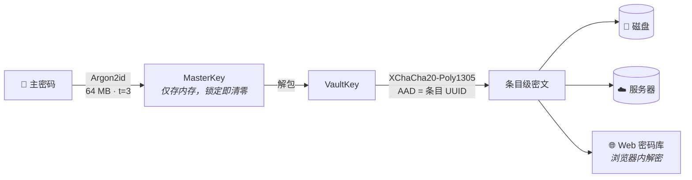
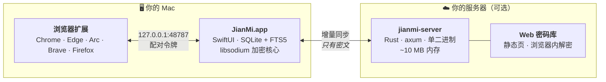

<div align="center">


<br>

[](https://github.com/LordVibeCoding/jianmi/releases/latest)
[](https://github.com/LordVibeCoding/jianmi/releases/latest)
[](apps/macos)
[](server)
[](apps/macos/JianMiTests)
[](LICENSE)

[English](README.md) · **简体中文**

*你的密码不经过任何人的手 —— 包括我们。*

[**安装**](#-安装) · [**使用体验**](#-使用体验) · [**安全**](#-安全) · [**自托管**](#%EF%B8%8F-自托管) · [**常见问题**](#-常见问题)

</div>

---

## 为什么是简密？

每个密码管理器都要求你信任*某个人*。简密只要求你信任**数学和你自己的硬件**。

|                        | **简密**              | 1Password    | Bitwarden      | KeePassXC      |
| ---------------------- | -------------------- | ------------ | -------------- | -------------- |
| 密码库存放在           | 🏠 **你的 Mac / 你的服务器** | 他们的云  | 他们的云¹      | 本地文件        |
| macOS 客户端           | ⚡️ **原生 Swift**     | Electron     | Electron       | Qt             |
| 空闲内存占用           | **~30 MB**           | ~300 MB      | ~250 MB        | ~90 MB         |
| 条目级「永不同步」     | ✅ **代码层强制**     | ❌           | ❌             | 无同步          |
| 注册即存快捷键         | ✅ **&lt; 5 秒**      | 部分          | ❌             | ❌             |
| 条目级同步合并         | ✅                   | ✅           | ✅             | ❌（整库文件）  |
| 价格                   | **免费 · MIT**       | 订阅制        | 免费增值        | 免费           |

<sub>¹ Bitwarden 可通过 Vaultwarden 自托管，但桌面客户端仍是 Electron。</sub>

## ✨ 使用体验

**在某个网站注册？** 任何地方按 <kbd>⌥⌘N</kbd>。
Spotlight 式面板弹出，站点名和网址**已经填好**（浏览器扩展实时上报 —— 零 macOS 权限、零弹窗）。输入账号，🎲 摇一个强密码，<kbd>↩</kbd>。存好了，全程不到 5 秒。

**要登录？** 按 <kbd>⌥⌘P</kbd>，敲三个字母：

| 按键 | 动作 |
|---|---|
| <kbd>↩</kbd> | 复制密码 *（剪贴板 30 秒后自毁）* |
| <kbd>⌥↩</kbd> | 复制账号 |
| <kbd>⌘↩</kbd> | 打开网站并复制密码 |
| <kbd>⌃↩</kbd> | 自动键入到当前焦点输入框 |

**在浏览器里？** 点扩展图标 —— 当前网站的匹配账号直接列出，**填充**、**复制密码**、**2FA** 一键完成，React/Vue 表单也能填。

**其余的一切**都在干净的三栏主窗口里：彩色类型徽章、实时渲染的 Markdown 笔记、带倒计时环的 TOTP、自定义字段、密码历史、可钉在屏幕上的置顶小窗，以及一眼可见锁定状态的菜单栏图标。

## 📦 安装

### 1 · 应用本体

从 [Releases](https://github.com/LordVibeCoding/jianmi/releases/latest) 下载 **`JianMi-x.y.z.dmg`** → 把 **JianMi** 拖进 **Applications**。

> **首次打开：** 右键 → *打开*（ad-hoc 签名 —— 刻意不用 Apple 开发者账号）。
> 或者：`xattr -cr /Applications/JianMi.app`

<details>
<summary>想从源码构建？（追求最大信任链推荐）</summary>

```bash
brew install xcodegen
git clone https://github.com/LordVibeCoding/jianmi && cd jianmi/apps/macos
xcodegen generate
xcodebuild -scheme JianMi -configuration Release build
```
</details>

### 2 · 浏览器扩展

打开应用 → **设置 → 浏览器扩展** → **导出扩展包**，然后：

| 浏览器 | 步骤 |
|---|---|
| Chrome / Edge / Arc / Brave | 解压 → `chrome://extensions` → *开发者模式* → *加载已解压的扩展程序* |
| Firefox | `about:debugging` → *此 Firefox* → *临时加载附加组件* |

把**配对令牌**（同一设置页）粘进扩展即可 —— 扩展只和 `127.0.0.1` 通信。

### 3 · 同步服务端 *（可选 —— 应用离线即完整可用）*

见下方[自托管](#%EF%B8%8F-自托管)。

## 🔐 安全

**端到端的密钥链路：**



- **处处零知识。** 同步服务器只存 `uuid + 版本号 + 密文`，别无其他。磁盘也一样：对 SQLite 文件跑 `strings` 找不到任何机密（我们有[一个测试](apps/macos/JianMiTests/VaultTests.swift)专门干这事）。
- **`仅本机` 是物理隔离，不是装饰。** 钱包助记词类条目强制标记，在同步引擎的网络层*之前*就被过滤 —— 通往服务器的代码路径对它们不存在。
- **没有找回后门。** 忘了主密码？建库时展示（仅一次）的恢复码是唯一入口。没有邮箱重置，没有客服后门 —— 我们认为这是特性。
- **跨语言证明。** Swift 加密的夹具用 Web 密码库同款 libsodium.js 解密，由[自动化测试](scripts/verify_web_crypto.mjs)保障 —— 加密格式不可能悄悄漂移。
- 锁屏/睡眠/空闲自动锁定 · concealed 剪贴板 30 秒自毁 · Touch ID · 冲突自动留副本而非静默覆盖。

<details>
<summary><b>威胁模型</b></summary>

| 威胁 | 防御 |
|---|---|
| 服务器被攻破 | 只有密文；密钥从不离开你的设备 |
| 网络窃听 | 载荷上网前已加密 |
| 同步令牌泄露 | 令牌只能换来密文；随时可轮换 |
| Mac 被盗（锁定态） | 字段级加密 + Argon2id 门槛 |
| 临时离开电脑 | 自动锁定 + 内存清零 |
| 剪贴板管理器 | `org.nspasteboard.ConcealedType` + 定时清除 |
| 本机恶意进程 | 桥接需配对令牌；仅绑定 localhost |
| **不防**：内核级木马、物理胁迫 | 任何软件都防不了 |

</details>

## 🏗️ 架构



| 组件 | 技术栈 | 理由 |
|---|---|---|
| [`apps/macos`](apps/macos) | Swift 6 · SwiftUI/AppKit · GRDB · swift-sodium | 非激活面板、Touch ID、<100ms 唤起 —— 只有原生能做到 |
| [`extension`](extension) | Manifest V3 · 原生 JS | 一份代码，两种构建（Chromium / Firefox） |
| [`server`](server) | Rust · axum · rusqlite | 零知识让服务端小到只有约 400 行 |
| [`web`](web) | 原生 JS + libsodium.js | 无构建链、无框架、最小攻击面 |

## ☁️ 自托管

```bash
cd server && cargo build --release
./target/release/jianmi-server --addr 0.0.0.0:8787 --data ./data
```

首次启动打印访问令牌 → 填入 **应用 → 设置 → 同步**。同一地址在浏览器打开就是你的 Web 密码库。

**一条命令部署到 Linux**（musl 静态二进制 + 加固 systemd）：

```bash
./scripts/deploy_server.sh user@你的服务器
```

> 即使走明文 HTTP，线上传输的也全是密文 —— 但套一层反向代理 TLS（Caddy/nginx）依然是好习惯。

## 🛠 开发

```bash
cd apps/macos && xcodebuild -scheme JianMi test   # 17 项测试：加密向量、库生命周期、
                                                  # 磁盘明文泄露检测、TCP 桥接回环
node scripts/verify_web_crypto.mjs                # Swift → JS 加密兼容性验证
cd server && cargo build --release                # 同步服务端
./scripts/build_dmg.sh                            # DMG + 扩展包 → dist/
```

设计文档：[docs/DESIGN.md](docs/DESIGN.md)

## 🗺 路线图

- [x] 核心密码库 · 快速捕获/搜索 · 浏览器扩展 · 自托管同步 · Web 密码库 · TOTP · 自动键入
- [ ] 加密附件
- [ ] 安全审计（弱密码 / 重复密码报告）
- [ ] 导入 / 导出（CSV、1Password、Bitwarden）
- [ ] Safari Web Extension
- [ ] Firefox 签名版扩展（AMO unlisted）

## ❓ 常见问题

<details>
<summary><b>「无法打开 JianMi，因为它来自身份不明的开发者」</b></summary>

右键应用 → *打开* → *打开*，一次即可。或 `xattr -cr /Applications/JianMi.app`。
本项目刻意不订阅 Apple 开发者计划；想要完全自己掌控的信任链，请从源码构建。
</details>

<details>
<summary><b>首次启动永远卡住 / 提示「没有响应」</b></summary>

开着 TUN 模式代理（Surge / Clash 等）时，Gatekeeper 首次启动的在线公证核查
可能被代理黑洞，导致应用卡死在 `dyld` 阶段。
解法：暂停代理后首次打开一次即可；或直接从源码安装
`./scripts/install_local.sh`（注册本地执行策略豁免，完全不走网络核查）。
该核查仅首次一次，之后启动秒开。
</details>

<details>
<summary><b>忘记主密码怎么办？</b></summary>

用建库时展示（仅一次！）的恢复码。没有别的办法 —— 没有邮箱重置，没有客服后门。请打印收好。
</details>

<details>
<summary><b>明文 HTTP 同步真的安全吗？</b></summary>

每个载荷在触网之前就已是 XChaCha20-Poly1305 密文，令牌也只能换来密文。TLS 增加的是元数据隐私，推荐但非必需。
</details>

<details>
<summary><b>为什么 Firefox 扩展是「临时」的？</b></summary>

Firefox 正式版要求扩展经 Mozilla 签名。可通过 `about:debugging` 临时加载（重启失效），或使用 Firefox Developer Edition 并设置 `xpinstall.signatures.required = false`。AMO 签名版已在路线图中。
</details>

---

<div align="center">

**MIT** © 简密贡献者 —— *为那些先读加密代码、再谈信任的人而做。*

</div>
